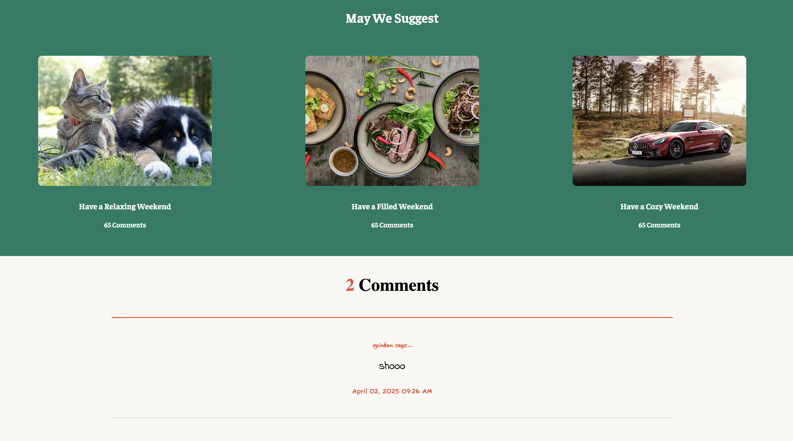

# 📝 My-Blog – A PHP-Based Blogging Platform

**My-Blog** is a custom-built blogging platform developed with PHP and CSS. It supports user registration, login, blog post creation, profiles, and relationship features. Designed to simulate a modern blogging experience, it blends essential frontend styling with dynamic PHP logic.

---

## ✨ Key Features

- 🧑‍💻 User registration and login system
- 📝 Create and manage blog posts
- 👤 View and edit user profiles
- 💬 Explore other users and blog relationships
- 🖼 Stylish, multi-page UI using custom CSS
- 📦 Includes zipped `includes/` for modular PHP structure

---

## 💻 Tech Stack

- PHP (Core scripting)
- CSS (Landing, login, post, and custom styles)
- HTML (within PHP templates)
- MySQL (expected for user/posts handling — db.sql assumed)

---

## 🖼 Preview

### 🏠 Blog Homepage


### 💬 Comment Section


---

## 🚀 How to Run Locally (XAMPP)

1. Start Apache & MySQL using **XAMPP**
2. Clone the repository:
   ```bash
   git clone https://github.com/direxxi/My-Blog.git
